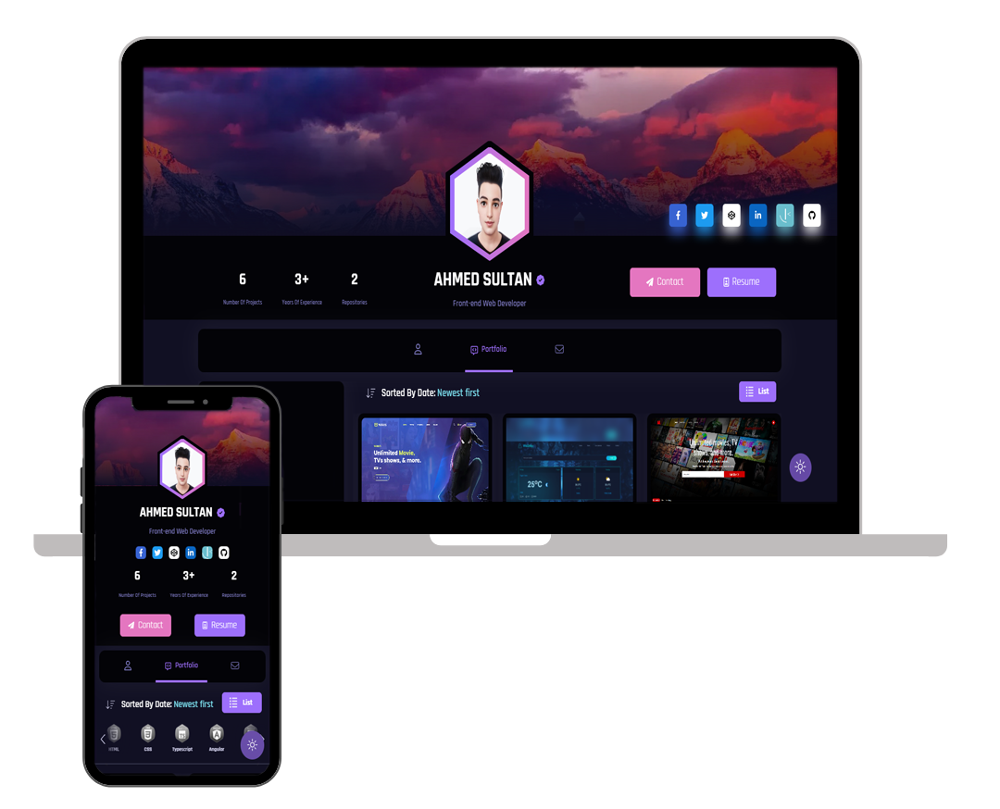

# Personal Portfolio - v0.0.1   [ahmed-sultan.tk](https://ahmed-sultan.tk)

This project is a modern, powerful, lightweight and high performance personal portfolio, which has been built with [Angular](https://angular.io) javascript Framework & [Bootstrap](https://getbootstrap.com) CSS framework. with [Firebase](https://firebase.google.com/).

  

 

<h3 align="center">
    🔹
    <a href="https://github.com/Ahmed-Soultan/Personal-Portfolio/issues">Report Bug</a> &nbsp; &nbsp;
    🔹
    <a href="https://github.com/Ahmed-Soultan/Personal-Portfolio/issues">Request Feature</a>
</h3>

### Third Parties
+ [Angular](https://angular.io/) Javascript framework.
+ [Bootstrap](https://getbootstrap.com/) CSS framework.
+ [Firebase](https://firebase.google.com/) Backend.
+ [Font awesome](https://fontawesome.com/) icons webfonts library.
+ [Swiper](https://swiperjs.com/) touch slider.

## Features

+ ⚡️ Modern UI Design + Reveal Animations.
+ ⚡️ Multi Page Layout.
+ ⚡️ Styled with Bootstrap + Custom SCSS.
+ ⚡️ Fully Responsive.
+ ⚡️ Valid HTML5 Structure.
+ ⚡️ Dark mode.
+ ⚡️ Clean code & high performance.

## Contact

If you want to contact me you can reach me at [Facebook](https://www.facebook.com/dev.ahmed.sultan).
